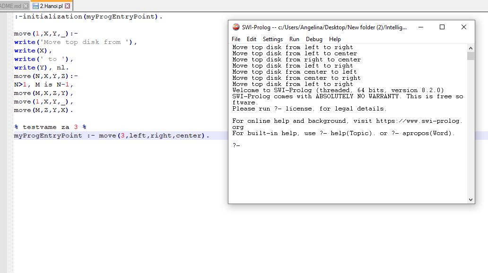

# IntelligentSystems
Задачи от практикум по дисциплина "Интелигентни системи"

## [Задачата с талисманите](Tasks/1.Talismani.pl)
По древно поверие всеки месец има свой камък-талисман. Например, месеците юни, юли и септември съответстват на камъните рубин, сапфир и перла. Тези камъни означават мъдрост, здраве и благополучие. На кой месец какъв камък- талисман съответства и какво означава, ако се знае, че:
- перла и рубин не съответстват на септември;
- през юни и юли мъдрост не се наблюдава;
- здраве не съответства на рубин; 
- благоденствие не се отнася за месец юни.

## [Ханойските кули](Tasks/2.Hanoi.pl)
Целта на този известен пъзел е да се преместят N диска от левия пилон на десния пилон, като се използва средния пилон като помощен. Условието е по-широк диск да не се слага върху по-тесен.

#### Има проблем, че се опитва да премести диска от лява позиция също в лява.

### Тестване за N = 3:

## [Автори в купето](Tasks/3.Kupe.pl)
Веднъж се случило в едно купе да пътуват астроном, поет, писател и драматург. Това са Алексеев, Борисов, Дмитриев и Константинов. Оказало се, че всеки един от тях е взел книга, написана от един от другите пътници в купето. Алексеев и Борисов потънали в четене, като предварително си разменили книгите. Поетът чете пиеса. Писателят, един много млад мъж, оставяйки книгата си казва, че никога и нищо не е чел по астрономия. Борисов е купил една от книгите на Дмитриев. Никой от пътниците не чете своя книга. Какво чете всеки един от тях? Преди да попитаме машината за логически извод за решението на задачата е необходимо да се формализират фактите. В тази задача са дадени 4 имена, 4 професии и 4 вида книги. Професията не е необходимо да се задава, защото тя може да се получи от книгата.